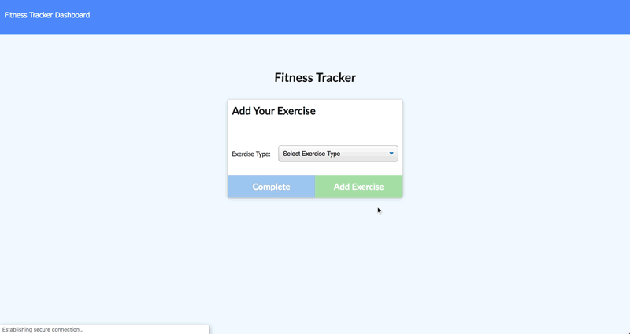

# FitnessTracker

Assignment for UofT SCS Coding Bootcamp
Week 17

# Directions for the project

- The user chooses to either continue their workout ("Continue Workout" button), create a new workout ("New Workout" button) or view their total workout stats ("dashboard" from the navigation bar.
- If the user chooses to either continue a workout or create a new workout, they will be directed to the workout page where they will be prompted to enter the exercise info.
- If the user chooses to view their stats, they will be navigated to the stats page where all their exercise data for the week will be aggregated and charted through visualization.
- All of the data is saved in MongoDB through the Atlas app.

# Deployment

Heroku
https://joshfdesign-fitness-tracker.herokuapp.com/

GitHub
https://github.com/TwistedPixels/FitnessTracker.git

# Usage

# Portfolio

https://twistedpixels.github.io/ProfessionalPortfolio/

# License

MIT License

Copyright (c) 2019 Josh Fréchette

Permission is hereby granted, free of charge, to any person obtaining a copy
of this software and associated documentation files (the "Software"), to deal
in the Software without restriction, including without limitation the rights
to use, copy, modify, merge, publish, distribute, sublicense, and/or sell
copies of the Software, and to permit persons to whom the Software is
furnished to do so, subject to the following conditions:

The above copyright notice and this permission notice shall be included in all
copies or substantial portions of the Software.

THE SOFTWARE IS PROVIDED "AS IS", WITHOUT WARRANTY OF ANY KIND, EXPRESS OR
IMPLIED, INCLUDING BUT NOT LIMITED TO THE WARRANTIES OF MERCHANTABILITY,
FITNESS FOR A PARTICULAR PURPOSE AND NONINFRINGEMENT. IN NO EVENT SHALL THE
AUTHORS OR COPYRIGHT HOLDERS BE LIABLE FOR ANY CLAIM, DAMAGES OR OTHER
LIABILITY, WHETHER IN AN ACTION OF CONTRACT, TORT OR OTHERWISE, ARISING FROM,
OUT OF OR IN CONNECTION WITH THE SOFTWARE OR THE USE OR OTHER DEALINGS IN THE
SOFTWARE.